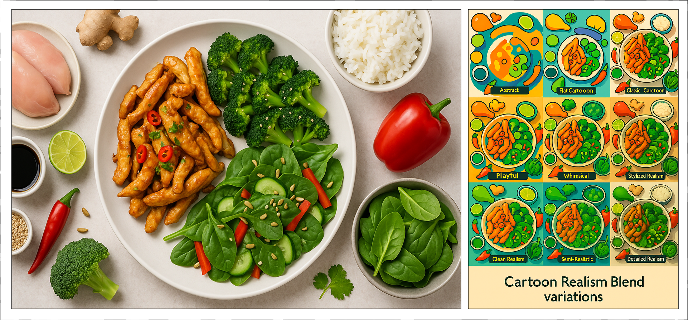
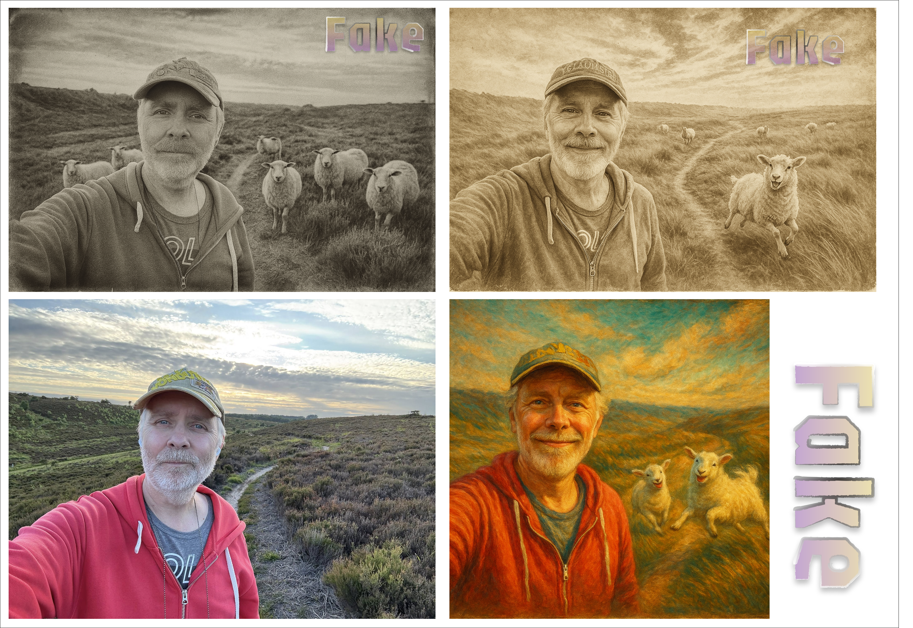
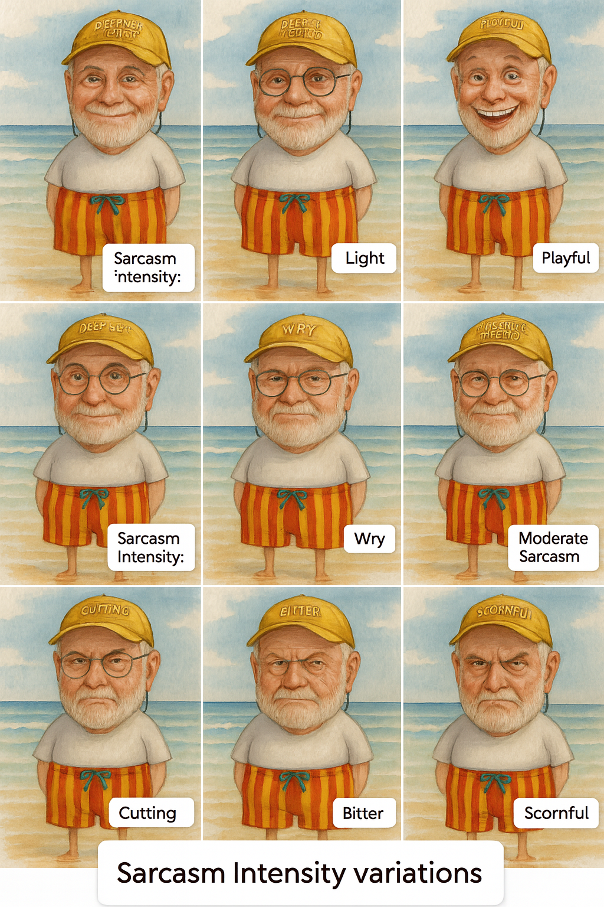

# 🧠 Latent Dimension Prompt Builder (LDPB)

A powerful tool for extracting and transferring semantic styles across different types of content using Large Language Models (LLMs).

## 🌟 What is it?

The Latent Dimension Prompt Builder helps you understand how AI models "see" and process information. Just like your brain instantly creates mental profiles when you see a person (height, hair color, eye color, etc.), LLMs process inputs across abstract **latent dimensions** to understand the essence of what they're perceiving.

This tool extracts these semantic fingerprints and lets you apply them creatively to other content.

## 🎯 Key Features

- **🧠 Semantic Analysis**: Extract the 20 most important latent dimensions from any text or image
- **🎨 Style Transfer**: Apply extracted semantic styles to generate new content
- **📊 JSON Output**: Structured data with dimension categories, explanations, and value spectrums
- **🖥️ Interactive Interface**: User-friendly web interface with real-time processing
- **🎭 Creative Applications**: Generate images, text, or other content with transferred semantic properties
- **🔧 Dimension Adjustment**: Interactive sliders to fine-tune importance ratings (1-100) for each dimension
- **📋 Multiple Prompt Formats**: Generate prompts in different formats:
  - **LLM Prompt**: Optimized for Large Language Models
  - **Text Prompt**: Simple text-based prompts
  - **Text/JSON Prompt**: Combined text and structured JSON output
  - **Grid Text/JSON Prompt**: 3x3 grid variations for image generation
  - **Text Variations**: 11 different text variations based on selected dimensions
- **🔗 Style Sharing**: Copy complete style configurations to clipboard for easy sharing via email or chat
- **📋 One-Click Copy**: Copy any prompt format to clipboard with toast notifications
- **💾 JSON Import/Export**: Load and save dimension configurations as JSON files
- **🔄 Real-time Updates**: Automatic prompt regeneration as you adjust settings
- **📱 Responsive Design**: Works seamlessly on desktop and mobile devices
- **🎯 Dimension Selection**: Radio button selection for grid and variation prompts
- **⚡ Toast Notifications**: User-friendly feedback for all actions
- **🔍 Context Support**: Works with text, paragraphs, and image references

## 🚀 How it Works

1. **Input Context**: Provide text, paragraphs, or images as input
2. **Dimension Extraction**: The tool asks the LLM to describe how it perceives the context
3. **Structured Output**: Returns a JSON object containing:
   - 20 most important latent dimensions
   - Category values for each dimension (e.g., "Calm", "Modern", "Muted")
   - Explanations of each dimension
   - 10 additional values showing the dimension's spectrum
   - Examples of how dimensions appear in the input
4. **Style Application**: Use the extracted semantic fingerprint to style other content

## 📖 Example Use Cases

- **Image Generation**: Generate a rose styled with the same expressive dimensions as a person
- **Content Creation**: Transfer the "aura" of one piece of content to another
- **Style Analysis**: Understand what makes content feel "modern", "calm", or "energetic"
- **Creative Inspiration**: Discover new ways to express ideas through semantic transfer

## 🖼️ Examples

Check out these examples to see the tool in action:


*Applying extracted cartoon related dimensions from a cartoon image and generating variations of 'Cartoon Realismm" dimension applied to a food image.*


*Playing around with dimensions from a piece of art I liked and then applying it to a selfie*

### Example 3 - variation on "sarkasm" from John Cleese style of humor
This example I made the LDPB analyse a joke from John Cleese. Asked it to "Focus on the style of humor" (+ the prompt from LDPB).
I then used the "Text Variations" prompt and applied it to a random piece of news, getting John Clese style with varied sarkasm results:

**Sarcasm Intensity variations**

| Sarcasm Intensity | Value                                                                    |
| ----------------- | ------------------------------------------------------------------------ |
| Sincere           | Gudrun Stürmer helps control pigeon populations using humane methods.    |
| Light             | Gudrun and the pigeons: just another day in urban wildlife care.         |
| Playful           | Gudrun’s undercover mission? Distracting pigeons with decoy eggs.        |
| Dry               | Nothing says modern progress like tricking birds with plastic.           |
| Wry               | Because nothing keeps nature in check like counterfeit eggs.             |
| Moderate Sarcasm  | Yes, the grand battle of city life: Gudrun vs. pigeons with fake eggs.   |
| Cutting           | Finally, a real solution to pigeons: lies, deception, and tiny props.    |
| Bitter            | We can’t fix housing, but at least Gudrun’s got the birds fooled.        |
| Scornful          | Human ingenuity peaked at plastic eggs for pigeons. Bravo, civilization. |
| Cruel             | Birds lay real eggs, we lay traps. Who’s the evolved species again?      |
| Venomous          | Ah yes, deceive nature to fix what we destroyed. Genius-level stuff.     |

**Based on this context (Quote from [BBC](https://www.bbc.com/news/topics/cx2pk70323et)):**

> Gudrun Stürmer in a hat and blue top, holding a pigeon
> 
> Using fake eggs to control pigeon populations
> 
> As many towns and cities are having to deal with exploding bird and animal populations, People Fixing the World takes a look at ways to control numbers in an effective and humane way.

#### Example of applied a set of dimensions from a text to an image! :-)

**John Clese sarcasm dimension applied to an image**

> TIP: You can **focus** on *parts* of the content you want to get dimensions on. Like the example above where I gave the LLM a John Cleese joke and asked it to focus on the style of humor, simply by prefixing the Prompt for LLM with: `Focus on the style of the humor`

### Example: Sharing John Cleese Style Dimensions

When you share a style configuration, you get a complete sharing message like this:

```
🔗 Latent Dimension Prompt Builder - Style Share

I'm sharing a style configuration with you! Here's how to use it:

1. Visit: https://netsi1964.github.io/LatentDimensionPromptBuilder/
2. Go to the "Adjust Dimensions" tab
3. Paste the JSON data below into the textarea
4. Click "Load JSON ↺" to apply the style

JSON Data:
{
  "latent_dimensions": [
    {
      "name": "Cynicism Level",
      "explanation": "Indicates how skeptical or distrustful the humor is toward institutions or professions",
      "value": "Mildly Cynical",
      "importance": 91,
      "example_value": "\"people couldn't figure out which side of the stamp to spit on\"",
      "values": [
        "Naive",
        "Idealistic",
        "Trusting",
        "Sincere",
        "Dry",
        "Mildly Cynical",
        "Cynical",
        "Jaded",
        "Mocking",
        "Acerbic",
        "Bitter"
      ]
    },
    {
      "name": "Punchline Ambiguity",
      "explanation": "How much the joke relies on indirectness or misdirection",
      "value": "Moderately Twisted",
      "importance": 84,
      "example_value": "\"which side of the stamp to spit on\"",
      "values": [
        "Literal",
        "Direct",
        "Obvious",
        "Simple",
        "Subtle",
        "Moderately Twisted",
        "Surprising",
        "Layered",
        "Cryptic",
        "Obscure",
        "Absurd"
      ]
    },
    {
      "name": "Authority Satire",
      "explanation": "Degree of mockery or critique aimed at figures of authority or respect",
      "value": "Sarcastic",
      "importance": 88,
      "example_value": "\"commemorative stamps commemorating lawyers\"",
      "values": [
        "Respectful",
        "Earnest",
        "Gentle",
        "Playful",
        "Ironic",
        "Sarcastic",
        "Cutting",
        "Disrespectful",
        "Ridiculing",
        "Scathing",
        "Defamatory"
      ]
    },
    {
      "name": "Formality of Language",
      "explanation": "The level of structured, formal, or polished language used",
      "value": "Conversational",
      "importance": 62,
      "example_value": "\"they had to withdraw them\"",
      "values": [
        "Academic",
        "Stilted",
        "Formal",
        "Polished",
        "Professional",
        "Conversational",
        "Colloquial",
        "Casual",
        "Slangy",
        "Unfiltered",
        "Crude"
      ]
    },
    {
      "name": "Historical Irony",
      "explanation": "How much the humor draws on or twists established traditions or respected symbols",
      "value": "Tradition-Undermining",
      "importance": 74,
      "example_value": "\"The U.S. Postal Service... commemorative stamps\"",
      "values": [
        "Reverent",
        "Respectful",
        "Cautious",
        "Balanced",
        "Neutral",
        "Tradition-Undermining",
        "Critical",
        "Ironic",
        "Darkly Ironic",
        "Mock-Historic",
        "Subversive"
      ]
    },
    {
      "name": "Delivery Sharpness",
      "explanation": "The abruptness or smoothness of the punchline delivery",
      "value": "Snappy",
      "importance": 71,
      "example_value": "\"spit on\"",
      "values": [
        "Rambling",
        "Drawn-out",
        "Gradual",
        "Flowing",
        "Smooth",
        "Snappy",
        "Abrupt",
        "Jarring",
        "Blunt",
        "Sudden",
        "Staccato"
      ]
    },
    {
      "name": "Absurdity Level",
      "explanation": "The degree of irrationality or surrealism in the humor",
      "value": "Mildly Absurd",
      "importance": 70,
      "example_value": "\"which side of the stamp to spit on\"",
      "values": [
        "Realistic",
        "Grounded",
        "Believable",
        "Commonplace",
        "Dry",
        "Mildly Absurd",
        "Silly",
        "Goofy",
        "Ridiculous",
        "Ludicrous",
        "Surreal"
      ]
    },
    {
      "name": "Cultural Specificity",
      "explanation": "How much the joke relies on a specific cultural context",
      "value": "American-Focused",
      "importance": 58,
      "example_value": "\"The U.S. Postal Service\"",
      "values": [
        "Universal",
        "Global",
        "Generic Western",
        "Modern",
        "Subtle American",
        "American-Focused",
        "Deep Americana",
        "Regional Dialect",
        "Obscure Reference",
        "In-Joke"
      ]
    },
    {
      "name": "Moral Edginess",
      "explanation": "Degree to which the joke challenges ethical norms or sensitivities",
      "value": "Borderline Tactless",
      "importance": 69,
      "example_value": "\"spit on\" and its implied disdain",
      "values": [
        "Wholesome",
        "Polite",
        "Safe",
        "Acceptable",
        "Crisp",
        "Borderline Tactless",
        "Provocative",
        "Rude",
        "Crass",
        "Offensive",
        "Shocking"
      ]
    },
    {
      "name": "Cleverness Quotient",
      "explanation": "The level of intellectual play or wordplay in the joke",
      "value": "Wittily Constructed",
      "importance": 85,
      "example_value": "\"couldn't figure out which side of the stamp to spit on\" as misdirection",
      "values": [
        "Dull",
        "Literal",
        "Plain",
        "Simple",
        "Slightly Clever",
        "Wittily Constructed",
        "Clever",
        "Sharp",
        "Ingenious",
        "Brilliant",
        "Genius"
      ]
    },
    {
      "name": "Nostalgic Tone",
      "explanation": "Level of old-fashioned or retro feeling in the humor",
      "value": "Mildly Retro",
      "importance": 44,
      "example_value": "\"postal service stamps\"",
      "values": [
        "Modern",
        "Contemporary",
        "Timeless",
        "Subtle Retro",
        "Implied Past",
        "Mildly Retro",
        "Old-Timey",
        "Vintage",
        "WWII Era",
        "Depression Era",
        "Victorian"
      ]
    },
    {
      "name": "Visual Imagination Trigger",
      "explanation": "How easily the joke conjures a mental image",
      "value": "Vividly Suggestive",
      "importance": 66,
      "example_value": "\"which side of the stamp to spit on\"",
      "values": [
        "Abstract",
        "Hard to Picture",
        "Subtle",
        "Mild",
        "Recognizable",
        "Vividly Suggestive",
        "Detailed",
        "Cinematic",
        "Graphic",
        "Extreme",
        "Grotesque"
      ]
    },
    {
      "name": "Temporal Specificity",
      "explanation": "How anchored the humor is to a specific time period",
      "value": "Late 20th Century",
      "importance": 49,
      "example_value": "\"postal service stamps\"",
      "values": [
        "Timeless",
        "Future-Oriented",
        "Present-Day",
        "2010s",
        "2000s",
        "Late 20th Century",
        "Mid-Century",
        "WWII Era",
        "Depression Era",
        "Victorian",
        "Historic"
      ]
    },
    {
      "name": "Irony Density",
      "explanation": "How much of the joke relies on irony",
      "value": "High Irony",
      "importance": 86,
      "example_value": "\"commemorative stamps commemorating lawyers\"",
      "values": [
        "None",
        "Low",
        "Light",
        "Implied",
        "Moderate",
        "High Irony",
        "Explicit",
        "Layered",
        "Recursive",
        "Meta-Ironic",
        "Post-Ironic"
      ]
    },
    {
      "name": "Use of Wordplay",
      "explanation": "Extent of puns, double meanings, or phonetic tricks",
      "value": "Mild Wordplay",
      "importance": 59,
      "example_value": "\"spit on\" as both literal and symbolic",
      "values": [
        "None",
        "Flat",
        "Plain",
        "Straight",
        "Dry",
        "Mild Wordplay",
        "Double Meaning",
        "Pun-Based",
        "Phonetic Trick",
        "Layered Pun",
        "Meta-Wordplay"
      ]
    },
    {
      "name": "Social Commentary Depth",
      "explanation": "Level of embedded social critique or observation",
      "value": "Light Commentary",
      "importance": 68,
      "example_value": "\"lawyers\" as a target of mild satire",
      "values": [
        "None",
        "Surface",
        "Thin",
        "Subtle",
        "Implied",
        "Light Commentary",
        "Moderate",
        "Direct",
        "Heavy-Handed",
        "Blunt",
        "Preachy"
      ]
    },
    {
      "name": "Syllabic Rhythm",
      "explanation": "How much the joke flows rhythmically in its syllables",
      "value": "Light Rhythm",
      "importance": 39,
      "example_value": "\"which side of the stamp to spit on\"",
      "values": [
        "Choppy",
        "Clunky",
        "Irregular",
        "Uneven",
        "Straightforward",
        "Light Rhythm",
        "Flowing",
        "Bouncy",
        "Lyrical",
        "Poetic",
        "Musical"
      ]
    },
    {
      "name": "Sarcasm Intensity",
      "explanation": "The harshness or bite of the sarcastic tone",
      "value": "Moderate Sarcasm",
      "importance": 73,
      "example_value": "\"people couldn't figure out which side of the stamp to spit on\"",
      "values": [
        "Sincere",
        "Light",
        "Playful",
        "Dry",
        "Wry",
        "Moderate Sarcasm",
        "Cutting",
        "Bitter",
        "Scornful",
        "Cruel",
        "Venomous"
      ]
    },
    {
      "name": "Professional Stereotype Use",
      "explanation": "How much the joke depends on professional clichés or generalizations",
      "value": "Relies on Tropes",
      "importance": 77,
      "example_value": "\"lawyers\" as untrustworthy stereotype",
      "values": [
        "Original",
        "Personalized",
        "Nuanced",
        "Balanced",
        "Neutral",
        "Relies on Tropes",
        "Recognizable",
        "Overused",
        "Cartoonish",
        "Exaggerated",
        "Exaggerated"
      ]
    },
    {
      "name": "Nostalgic Tone",
      "explanation": "Level of old-fashioned or retro feeling in the humor",
      "value": "Mildly Retro",
      "importance": 44,
      "example_value": "\"postal service stamps\"",
      "values": [
        "Modern",
        "Contemporary",
        "Timeless",
        "Subtle Retro",
        "Implied Past",
        "Mildly Retro",
        "Old-Timey",
        "Vintage",
        "WWII Era",
        "Depression Era",
        "Victorian"
      ]
    }
  ]
}

Sorry about the long URL - future versions of LDPB will fix this! 😊

---
Shared with Latent Dimension Prompt Builder
```

You can try this example yourself by copying the JSON data above and loading it into the tool!

## 🛠️ Usage

1. Open the [Latent Dimension Prompt Builder](https://netsi1964.github.io/LatentDimensionPromptBuilder/)
2. Enter your context (text, paragraph, or upload an image)
3. Click "Extract Dimensions" to analyze the semantic properties
4. Review the structured JSON output with all latent dimensions
5. Use the extracted semantic fingerprint for creative applications

## 🔗 Resources

- **Live Demo**: [https://netsi1964.github.io/LatentDimensionPromptBuilder/](https://netsi1964.github.io/LatentDimensionPromptBuilder/)
- **LinkedIn Post**: [Read about the Latent Dimension Prompt Builder](https://www.linkedin.com/feed/update/urn:li:ugcPost:7348996154723860481/?source=LatentPromptBuilder)
- **GitHub Repository**: [https://github.com/netsi1964/LatentDimensionPromptBuilder](https://github.com/netsi1964/LatentDimensionPromptBuilder)

## 👨‍💻 Creator

This tool was created by **netsi1964** as an exploration of how Large Language Models process and understand semantic information. The project demonstrates how AI models can extract and transfer the "essence" or "style" of content across different mediums.

## 💡 The Philosophy

> "Because to an LLM, everything is just data."

This tool embodies the idea that AI models can understand and transfer semantic properties across different types of content. Just as your brain can recognize patterns and styles, LLMs can extract and apply these patterns in creative ways.

To me, it is a profound finding that **detecting, altering, and reapplying the LLM labels for any object is possible**. This discovery quantifies content, style, and semantic essence in ways that can be shared, modified, and transferred. It's like having a universal language for describing the "soul" of any piece of content—whether it's text, images, or other media.

This understanding emerged from countless hours of learning from the AI community. I'm deeply grateful to the content creators who share their knowledge and insights:

- **[Machine Learning Street Talk](https://www.youtube.com/@MachineLearningStreetTalk)** - For deep dives into AI research and practical applications
- **[The AI in Business Podcast](https://podcasts.apple.com/us/podcast/the-ai-in-business-podcast/id670771965/)** - For insights into real-world AI implementations
- **[The Stephen Wolfram Podcast](https://podcasts.apple.com/dk/podcast/the-stephen-wolfram-podcast/id1296350707)** - For fundamental perspectives on computation and AI
- And many more YouTube channels and podcasts that continue to educate and inspire

**Thank you to all content sharing people out there!** Your work makes discoveries like this possible.

## 📄 License

This project is open source and available under the [LICENSE](LICENSE) file.

---

**Ready to explore the semantic dimensions of your content?** [Try the Latent Dimension Prompt Builder now!](https://netsi1964.github.io/LatentDimensionPromptBuilder/)
